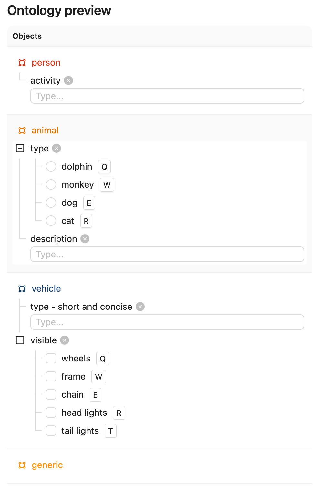
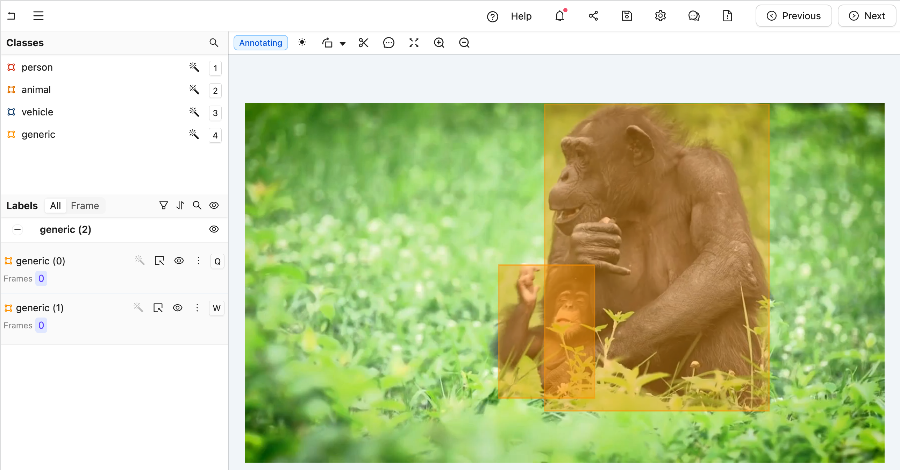
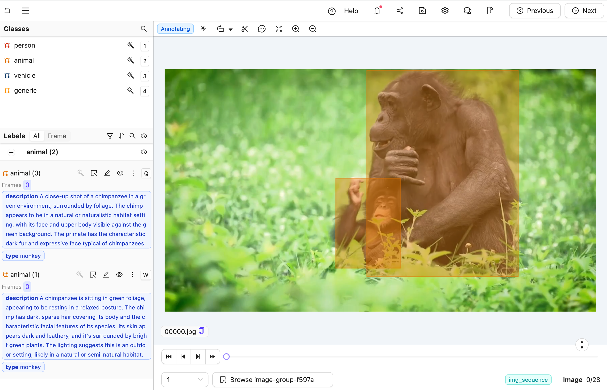

## GCP Examples

### Classifying generic objects with Claude 3.5 Sonnet

The goals of this example is to:

1. Obtain an editor agent that can convert generic object annotations (class-less coordinates) into class specific annotations with nested attributes like descriptions, radio buttons, and checklists.
2. Show how you can use both the [`OntologyDataModel`](../../reference/core.md#encord_agents.core.ontology.OntologyDataModel) and the [`dep_object_crops`](../../reference/editor_agents.md#encord_agents.gcp.dependencies.dep_object_crops) dependency.

**Setup**

To get setup, you need to

- Create a virtual python environment
- Install necessary dependencies
- Get an [Anthropic API key](https://www.anthropic.com/api){ target="\_blank", rel="noopener noreferrer" }
- Setup Encord [authentication](../../authentication.md)

First, we create the virtual environment.
Before you do the following actions, make sure you have authentication with Anthropic and Encord sorted (see links in list above).

```shell
python -m venv venv
source venv/bin/activate
python -m pip install encord-agents anthropic
export ANTHROPIC_API_KEY="<your_api_key>"
export ENCORD_SSH_KEY_FILE="/path/to/your/private/key"
```

**Project setup**

We're using a project with the following ontology:

{width=300}


??? "See the ontology JSON"
    ```json title="ontology.json"
    {
      "objects": [
        {
          "id": "1",
          "name": "person",
          "color": "#D33115",
          "shape": "bounding_box",
          "featureNodeHash": "2xlDPPAG",
          "required": false,
          "attributes": [
            {
              "id": "1.1",
              "featureNodeHash": "aFCN9MMm",
              "type": "text",
              "name": "activity",
              "required": false,
              "dynamic": false
            }
          ]
        },
        {
          "id": "2",
          "name": "animal",
          "color": "#E27300",
          "shape": "bounding_box",
          "featureNodeHash": "3y6JxTUX",
          "required": false,
          "attributes": [
            {
              "id": "2.1",
              "featureNodeHash": "2P7LTUZA",
              "type": "radio",
              "name": "type",
              "required": false,
              "options": [
                {
                  "id": "2.1.1",
                  "featureNodeHash": "gJvcEeLl",
                  "label": "dolphin",
                  "value": "dolphin",
                  "options": []
                },
                {
                  "id": "2.1.2",
                  "featureNodeHash": "CxrftGS4",
                  "label": "monkey",
                  "value": "monkey",
                  "options": []
                },
                {
                  "id": "2.1.3",
                  "featureNodeHash": "OQyWm7Sm",
                  "label": "dog",
                  "value": "dog",
                  "options": []
                },
                {
                  "id": "2.1.4",
                  "featureNodeHash": "CDKmYJK/",
                  "label": "cat",
                  "value": "cat",
                  "options": []
                }
              ],
              "dynamic": false
            },
            {
              "id": "2.2",
              "featureNodeHash": "5fFgrM+E",
              "type": "text",
              "name": "description",
              "required": false,
              "dynamic": false
            }
          ]
        },
        {
          "id": "3",
          "name": "vehicle",
          "color": "#16406C",
          "shape": "bounding_box",
          "featureNodeHash": "llw7qdWW",
          "required": false,
          "attributes": [
            {
              "id": "3.1",
              "featureNodeHash": "79mo1G7Q",
              "type": "text",
              "name": "type - short and concise",
              "required": false,
              "dynamic": false
            },
            {
              "id": "3.2",
              "featureNodeHash": "OFrk07Ds",
              "type": "checklist",
              "name": "visible",
              "required": false,
              "options": [
                {
                  "id": "3.2.1",
                  "featureNodeHash": "KmX/HjRT",
                  "label": "wheels",
                  "value": "wheels"
                },
                {
                  "id": "3.2.2",
                  "featureNodeHash": "H6qbEcdj",
                  "label": "frame",
                  "value": "frame"
                },
                {
                  "id": "3.2.3",
                  "featureNodeHash": "gZ9OucoQ",
                  "label": "chain",
                  "value": "chain"
                },
                {
                  "id": "3.2.4",
                  "featureNodeHash": "cit3aZSz",
                  "label": "head lights",
                  "value": "head_lights"
                },
                {
                  "id": "3.2.5",
                  "featureNodeHash": "qQ3PieJ/",
                  "label": "tail lights",
                  "value": "tail_lights"
                }
              ],
              "dynamic": false
            }
          ]
        },
        {
          "id": "4",
          "name": "generic",
          "color": "#FE9200",
          "shape": "bounding_box",
          "featureNodeHash": "jootTFfQ",
          "required": false,
          "attributes": []
        }
      ],
      "classifications": []
    }
    ```

    To construct the exact same ontology, you can do

    ```python
    import json
    from encord.objects.ontology_structure import OntologyStructure
    from encord_agents.core.utils import get_user_client

    encord_client = get_user_client()
    structure = OntologyStructure.from_dict(json.loads("{the_json_above}"))
    ontology = encord_client.create_ontology(
        title="Your ontology title",
        structure=structure
    )
    print(ontology.ontology_hash)
    ```


It can really be any ontology, as long as the object types are the same and there is one entry called `"generic"`.
Attach that ontology to a project with visual content (images, image groups, or videos).

The goal is to be able to trigger an agent that takes a labeling task from Figure A to Figure B, below (hint: you can click them and use keyboard arrows toggle between images).

<div style="display: flex; justify-content: space-between; gap: 1em;">
    <figure style="text-align: center; flex: 1; margin: 1em 0;">
      
      <strong>Figure A:</strong> A generic label without any type annotations. Notice that in the left sidebar, there are two "generic" labels.
    </figure>
    <figure style="text-align: center; flex: 1; margin: 1em 0;">
      
      <strong>Figure B:</strong> A nested label with all details filled for the predicted class. Notice that in the left sidebar, there are two "animal" labels with both type and description filled.
    </figure>
</div>


**The agent**  

!!! warning
    Some of the code blocks suffers from wrong indentation in this section. If you intend to copy/paste, we **strongly** recommend that you do it from the full code below rather than from each sub-section👇
    

??? "The full code for `agent.py`"
    <!--codeinclude-->

    [agent.py](../../code_examples/gcp/object_classification.py) linenums:1

    <!--/codeinclude-->

Create a file called `"agent.py"`.
Let's begin with some simple imports and reading the project ontology.
For this, you will need to have your `<project_hash>` ready.

<!--codeinclude-->

[agent.py](../../code_examples/gcp/object_classification.py) lines:1-13

<!--/codeinclude-->

Now that we have the project, we can extract the generic ontology object as well as that actual ontology objects that we care about.

<!--codeinclude-->

[agent.py](../../code_examples/gcp/object_classification.py) lines:14-18

<!--/codeinclude-->

The code above will sort the ontology objects based on whether they have the title `"generic"` or not.
We'll use the generic object to query image crops from within the agent, but before that, we'll use the `other_objects` to inform 
Claude about the information that we are caring about.

For that there is a useful class called [`OntologyDataModel`](../../reference/core.md#encord_agents.core.ontology.OntologyDataModel) which understands how to translate from Encord ontology [`Objects`](){ target="\_blank", rel="noopener noreferrer" } to a [pydantic](https://docs.pydantic.dev/latest/){ target="\_blank", rel="noopener noreferrer" } model and from json objects to Encord [`ObjectInstance`](https://docs.encord.com/sdk-documentation/sdk-references/ObjectInstance){ target="\_blank", rel="noopener noreferrer" }s. 


Next up is preparing the system prompt to go along with every object crop.
For that, we'll use the `data_model` from above to create the json schema.
It is worth noticing that we pass in just the `other_objetcs` such that the model
is only allowed to choose between the object types that are not of the generic one.

<!--codeinclude-->

[agent.py](../../code_examples/gcp/object_classification.py) lines:20-29

<!--/codeinclude-->

??? "See the result of `data_model.model_json_schema_str` for the given example"
    ```json
    {
      "$defs": {
        "ActivityTextModel": {
          "properties": {
            "feature_node_hash": {
              "const": "aFCN9MMm",
              "description": "UUID for discrimination. Must be included in json as is.",
              "enum": [
                "aFCN9MMm"
              ],
              "title": "Feature Node Hash",
              "type": "string"
            },
            "value": {
              "description": "Please describe the image as accurate as possible focusing on 'activity'",
              "maxLength": 1000,
              "minLength": 0,
              "title": "Value",
              "type": "string"
            }
          },
          "required": [
            "feature_node_hash",
            "value"
          ],
          "title": "ActivityTextModel",
          "type": "object"
        },
        "AnimalNestedModel": {
          "properties": {
            "feature_node_hash": {
              "const": "3y6JxTUX",
              "description": "UUID for discrimination. Must be included in json as is.",
              "enum": [
                "3y6JxTUX"
              ],
              "title": "Feature Node Hash",
              "type": "string"
            },
            "type": {
              "$ref": "#/$defs/TypeRadioModel",
              "description": "A mutually exclusive radio attribute to choose exactly one option that best matches to the give visual input."
            },
            "description": {
              "$ref": "#/$defs/DescriptionTextModel",
              "description": "A text attribute with carefully crafted text to describe the property."
            }
          },
          "required": [
            "feature_node_hash",
            "type",
            "description"
          ],
          "title": "AnimalNestedModel",
          "type": "object"
        },
        "DescriptionTextModel": {
          "properties": {
            "feature_node_hash": {
              "const": "5fFgrM+E",
              "description": "UUID for discrimination. Must be included in json as is.",
              "enum": [
                "5fFgrM+E"
              ],
              "title": "Feature Node Hash",
              "type": "string"
            },
            "value": {
              "description": "Please describe the image as accurate as possible focusing on 'description'",
              "maxLength": 1000,
              "minLength": 0,
              "title": "Value",
              "type": "string"
            }
          },
          "required": [
            "feature_node_hash",
            "value"
          ],
          "title": "DescriptionTextModel",
          "type": "object"
        },
        "PersonNestedModel": {
          "properties": {
            "feature_node_hash": {
              "const": "2xlDPPAG",
              "description": "UUID for discrimination. Must be included in json as is.",
              "enum": [
                "2xlDPPAG"
              ],
              "title": "Feature Node Hash",
              "type": "string"
            },
            "activity": {
              "$ref": "#/$defs/ActivityTextModel",
              "description": "A text attribute with carefully crafted text to describe the property."
            }
          },
          "required": [
            "feature_node_hash",
            "activity"
          ],
          "title": "PersonNestedModel",
          "type": "object"
        },
        "TypeRadioEnum": {
          "enum": [
            "dolphin",
            "monkey",
            "dog",
            "cat"
          ],
          "title": "TypeRadioEnum",
          "type": "string"
        },
        "TypeRadioModel": {
          "properties": {
            "feature_node_hash": {
              "const": "2P7LTUZA",
              "description": "UUID for discrimination. Must be included in json as is.",
              "enum": [
                "2P7LTUZA"
              ],
              "title": "Feature Node Hash",
              "type": "string"
            },
            "choice": {
              "$ref": "#/$defs/TypeRadioEnum",
              "description": "Choose exactly one answer from the given options."
            }
          },
          "required": [
            "feature_node_hash",
            "choice"
          ],
          "title": "TypeRadioModel",
          "type": "object"
        },
        "TypeShortAndConciseTextModel": {
          "properties": {
            "feature_node_hash": {
              "const": "79mo1G7Q",
              "description": "UUID for discrimination. Must be included in json as is.",
              "enum": [
                "79mo1G7Q"
              ],
              "title": "Feature Node Hash",
              "type": "string"
            },
            "value": {
              "description": "Please describe the image as accurate as possible focusing on 'type - short and concise'",
              "maxLength": 1000,
              "minLength": 0,
              "title": "Value",
              "type": "string"
            }
          },
          "required": [
            "feature_node_hash",
            "value"
          ],
          "title": "TypeShortAndConciseTextModel",
          "type": "object"
        },
        "VehicleNestedModel": {
          "properties": {
            "feature_node_hash": {
              "const": "llw7qdWW",
              "description": "UUID for discrimination. Must be included in json as is.",
              "enum": [
                "llw7qdWW"
              ],
              "title": "Feature Node Hash",
              "type": "string"
            },
            "type__short_and_concise": {
              "$ref": "#/$defs/TypeShortAndConciseTextModel",
              "description": "A text attribute with carefully crafted text to describe the property."
            },
            "visible": {
              "$ref": "#/$defs/VisibleChecklistModel",
              "description": "A collection of boolean values indicating which concepts are applicable according to the image content."
            }
          },
          "required": [
            "feature_node_hash",
            "type__short_and_concise",
            "visible"
          ],
          "title": "VehicleNestedModel",
          "type": "object"
        },
        "VisibleChecklistModel": {
          "properties": {
            "feature_node_hash": {
              "const": "OFrk07Ds",
              "description": "UUID for discrimination. Must be included in json as is.",
              "enum": [
                "OFrk07Ds"
              ],
              "title": "Feature Node Hash",
              "type": "string"
            },
            "wheels": {
              "description": "Is 'wheels' applicable or not?",
              "title": "Wheels",
              "type": "boolean"
            },
            "frame": {
              "description": "Is 'frame' applicable or not?",
              "title": "Frame",
              "type": "boolean"
            },
            "chain": {
              "description": "Is 'chain' applicable or not?",
              "title": "Chain",
              "type": "boolean"
            },
            "head_lights": {
              "description": "Is 'head lights' applicable or not?",
              "title": "Head Lights",
              "type": "boolean"
            },
            "tail_lights": {
              "description": "Is 'tail lights' applicable or not?",
              "title": "Tail Lights",
              "type": "boolean"
            }
          },
          "required": [
            "feature_node_hash",
            "wheels",
            "frame",
            "chain",
            "head_lights",
            "tail_lights"
          ],
          "title": "VisibleChecklistModel",
          "type": "object"
        }
      },
      "properties": {
        "choice": {
          "description": "Choose exactly one answer from the given options.",
          "discriminator": {
            "mapping": {
              "2xlDPPAG": "#/$defs/PersonNestedModel",
              "3y6JxTUX": "#/$defs/AnimalNestedModel",
              "llw7qdWW": "#/$defs/VehicleNestedModel"
            },
            "propertyName": "feature_node_hash"
          },
          "oneOf": [
            {
              "$ref": "#/$defs/PersonNestedModel"
            },
            {
              "$ref": "#/$defs/AnimalNestedModel"
            },
            {
              "$ref": "#/$defs/VehicleNestedModel"
            }
          ],
          "title": "Choice"
        }
      },
      "required": [
        "choice"
      ],
      "title": "ObjectsRadioModel",
      "type": "object"
    }
    ```

With the system prompt ready, we can instantiate an api client for Claude.

<!--codeinclude-->

[agent.py](../../code_examples/gcp/object_classification.py) lines:31-33

<!--/codeinclude-->


Now, let's define the editor agent.

<!--codeinclude-->

[agent.py](../../code_examples/gcp/object_classification.py) lines:36-45

<!--/codeinclude-->

In the code above, there are two main things to stress. 

1. All arguments are automatically injected when this agent is called. For more details on dependency injections, please see [here](../../dependencies.md).
2. The [`dep_object_crops`](../../references/editor_agents.md#encord_agents.gcp.dependencies.dep_object_crops) dependency is a little special in that you can provide it filtering arguments. In this case, we tell it to only include object crops when the object instances are of the "generic" type. We do this because we don't want to keep on working on those that have already been converted to "actual labels."

Now, we can call Claude given the image crops.
Notice how the `crop` variable has a convenient `b64_encoding` method to produce an input that Claude understands.

<!--codeinclude-->

[agent.py](../../code_examples/gcp/object_classification.py) lines:46-59

<!--/codeinclude-->

To parse the message from Claude, the `data_model` is again useful.
When called with a JSON string, it attempts to parse it with respect to the 
the JSON schema we saw above to create an Encord object instance.
If successful, the old generic object can be removed and the newly classified object added. 

<!--codeinclude-->

[agent.py](../../code_examples/gcp/object_classification.py) lines:61-81

<!--/codeinclude-->

Finally, we'll save the labels with Encord.

<!--codeinclude-->

[agent.py](../../code_examples/gcp/object_classification.py) lines:83-85

<!--/codeinclude-->


**Testing the model**  

__Step 1: run the agent__  
With the agent laid down, we can run it and test it.
In your current terminal, run the function:

```shell
functions-framework --target=agent --debug --source agent.py 
```

This will run the agent in debug mode for you to test it.

__Step 2: annotate some generic objects__

Open your project within [the Encord platform](https://app.encord.com/projects){ target="\_blank", rel="noopener noreferrer" } in your browser and try annotating an image with some generic objetcs.
Once you've done that, you can copy the url from your browser.

!!! hint
    The url should have roughly this format: `"https://app.encord.com/label_editor/{project_hash}/{data_hash}/{frame}"`.

__Step 3: trigger the agent__  

In another shell, source your virtual environment and test the agent.

```shell
source venv/bin/activate
encord-agents test local agent <your_url>
```

If the test is successful, you should be able to refresh your browser and see the result of what your agent.

Once you're ready to deploy your agent, you can go to [the deployment documentation](../gcp.md#deployment) to learn more.

## Agent examples in the making

- Tightening Bounding Boxes with SAM
- Extrapolating labels with DINOv
- Triggering internal notification system
- Label assertion
