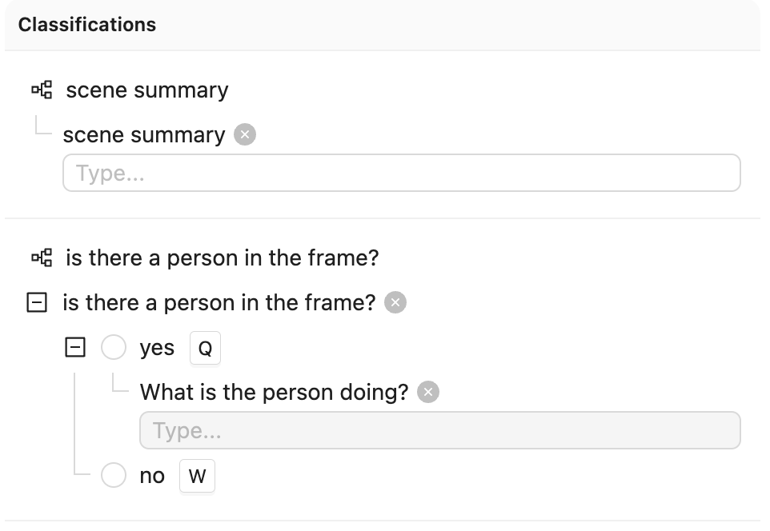
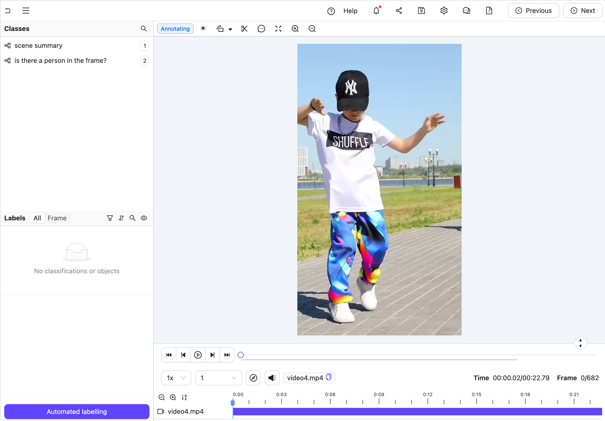
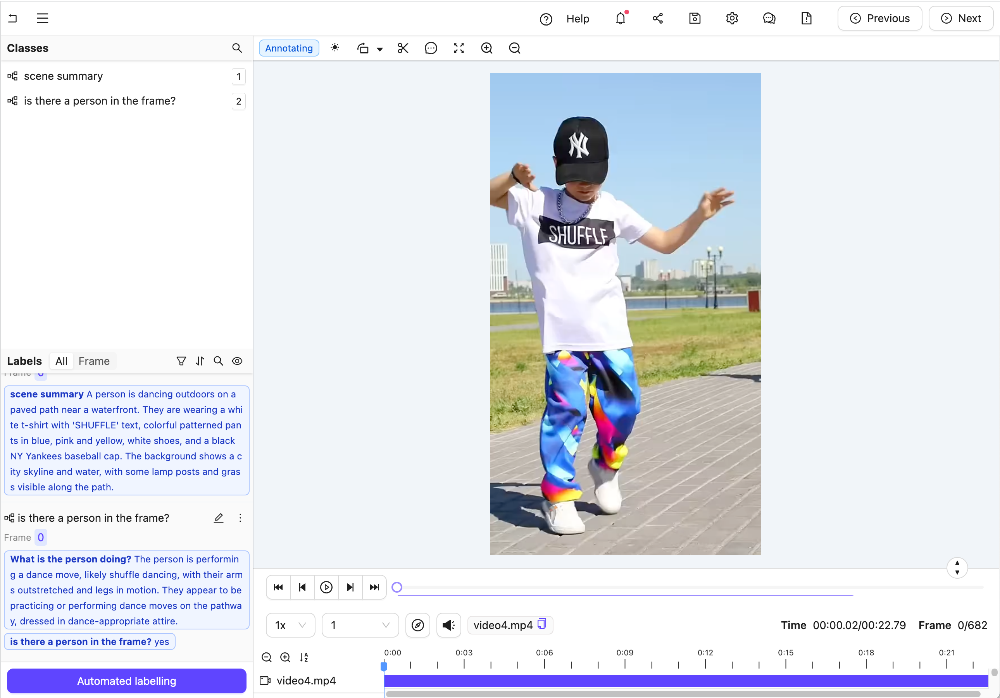

## GCP Examples

### Nested frame classification with Claude 3.5 Sonnet

The goals of this example are:

1. Create an editor agent that automatically adds frame-level classifications.
2. Demonstrate how to use the [`OntologyDataModel`](../../reference/core.md#encord_agents.core.ontology.OntologyDataModel) for classifications.

**Setup**

To get set up, you must:

- Create a virtual python environment
- Install necessary dependencies
- Get an [Anthropic API key](https://www.anthropic.com/api){ target="\_blank", rel="noopener noreferrer" }
- Set up Encord [authentication](../../authentication.md)

First, create the virtual environment.
Before proceeding, ensure you can authenticate with Anthropic and with Encord (see links in list above).

```shell
python -m venv venv
source venv/bin/activate
python -m pip install encord-agents anthropic
export ANTHROPIC_API_KEY="<your_api_key>"
export ENCORD_SSH_KEY_FILE="/path/to/your/private/key"
```

**Project setup**

We' are using a Project with the following Ontology:

{width=300}

??? "See the ontology JSON"
    ```json title="ontology.json"
    {
      "objects": [],
      "classifications": [
        {
          "id": "1",
          "featureNodeHash": "TTkHMtuD",
          "attributes": [
            {
              "id": "1.1",
              "featureNodeHash": "+1g9I9Sg",
              "type": "text",
              "name": "scene summary",
              "required": false,
              "dynamic": false
            }
          ]
        },
        {
          "id": "2",
          "featureNodeHash": "xGV/wCD0",
          "attributes": [
            {
              "id": "2.1",
              "featureNodeHash": "k3EVexk7",
              "type": "radio",
              "name": "is there a person in the frame?",
              "required": false,
              "options": [
                {
                  "id": "2.1.1",
                  "featureNodeHash": "EkGwhcO4",
                  "label": "yes",
                  "value": "yes",
                  "options": [
                    {
                      "id": "2.1.1.1",
                      "featureNodeHash": "mj9QCDY4",
                      "type": "text",
                      "name": "What is the person doing?",
                      "required": false
                    }
                  ]
                },
                {
                  "id": "2.1.2",
                  "featureNodeHash": "37rMLC/v",
                  "label": "no",
                  "value": "no",
                  "options": []
                }
              ],
              "dynamic": false
            }
          ]
        }
      ]
    }
    ```

    To construct the exact same ontology, you can do

    ```python
    import json
    from encord.objects.ontology_structure import OntologyStructure
    from encord_agents.core.utils import get_user_client

    encord_client = get_user_client()
    structure = OntologyStructure.from_dict(json.loads("{the_json_above}"))
    ontology = encord_client.create_ontology(
        title="Your ontology title",
        structure=structure
    )
    print(ontology.ontology_hash)
    ```

Your Ontology can be any Ontology containing classifications.
Attach your Ontology to a Project with visual content (images, image groups, or videos).

An agent that transforms a labeling task from Figure A to Figure B, as shown below must be triggered. *(Hint: Click the images and use the keyboard arrows to toggle between them.)*

<div style="display: flex; justify-content: space-between; gap: 1em;">
    <figure style="text-align: center; flex: 1; margin: 1em 0;">
      
      <strong>Figure A:</strong> no classification labels.
    </figure>
    <figure style="text-align: center; flex: 1; margin: 1em 0;">
      
      <strong>Figure B:</strong> Multiple nested labels coming from an LLM.
    </figure>
</div>

??? "The full code for `agent.py`"
    <!--codeinclude-->
    [agent.py](../../code_examples/gcp/frame_classification.py) linenums:1
    <!--/codeinclude-->

Let's go through the code section by section.

First, we import dependencies and set up the Project:

!!! info
    Make sure to insert your Project's hash here.

<!--codeinclude-->
[agent.py](../../code_examples/gcp/frame_classification.py) lines:1-15
<!--/codeinclude-->

Next, we create a data model and a system prompt based on the Project Ontology that will tell Claude how to structure its response:

<!--codeinclude-->
[agent.py](../../code_examples/gcp/frame_classification.py) lines:18-29
<!--/codeinclude-->


??? "See the result of `data_model.model_json_schema_str` for the given example"
    ```json
    {
      "$defs": {
        "IsThereAPersonInTheFrameRadioModel": {
          "properties": {
            "feature_node_hash": {
              "const": "k3EVexk7",
              "description": "UUID for discrimination. Must be included in json as is.",
              "enum": [
                "k3EVexk7"
              ],
              "title": "Feature Node Hash",
              "type": "string"
            },
            "choice": {
              "description": "Choose exactly one answer from the given options.",
              "discriminator": {
                "mapping": {
                  "37rMLC/v": "#/$defs/NoNestedRadioModel",
                  "EkGwhcO4": "#/$defs/YesNestedRadioModel"
                },
                "propertyName": "feature_node_hash"
              },
              "oneOf": [
                {
                  "$ref": "#/$defs/YesNestedRadioModel"
                },
                {
                  "$ref": "#/$defs/NoNestedRadioModel"
                }
              ],
              "title": "Choice"
            }
          },
          "required": [
            "feature_node_hash",
            "choice"
          ],
          "title": "IsThereAPersonInTheFrameRadioModel",
          "type": "object"
        },
        "NoNestedRadioModel": {
          "properties": {
            "feature_node_hash": {
              "const": "37rMLC/v",
              "description": "UUID for discrimination. Must be included in json as is.",
              "enum": [
                "37rMLC/v"
              ],
              "title": "Feature Node Hash",
              "type": "string"
            },
            "title": {
              "const": "no",
              "default": "Constant value - should be included as-is.",
              "enum": [
                "no"
              ],
              "title": "Title",
              "type": "string"
            }
          },
          "required": [
            "feature_node_hash"
          ],
          "title": "NoNestedRadioModel",
          "type": "object"
        },
        "SceneSummaryTextModel": {
          "properties": {
            "feature_node_hash": {
              "const": "+1g9I9Sg",
              "description": "UUID for discrimination. Must be included in json as is.",
              "enum": [
                "+1g9I9Sg"
              ],
              "title": "Feature Node Hash",
              "type": "string"
            },
            "value": {
              "description": "Please describe the image as accurate as possible focusing on 'scene summary'",
              "maxLength": 1000,
              "minLength": 0,
              "title": "Value",
              "type": "string"
            }
          },
          "required": [
            "feature_node_hash",
            "value"
          ],
          "title": "SceneSummaryTextModel",
          "type": "object"
        },
        "WhatIsThePersonDoingTextModel": {
          "properties": {
            "feature_node_hash": {
              "const": "mj9QCDY4",
              "description": "UUID for discrimination. Must be included in json as is.",
              "enum": [
                "mj9QCDY4"
              ],
              "title": "Feature Node Hash",
              "type": "string"
            },
            "value": {
              "description": "Please describe the image as accurate as possible focusing on 'What is the person doing?'",
              "maxLength": 1000,
              "minLength": 0,
              "title": "Value",
              "type": "string"
            }
          },
          "required": [
            "feature_node_hash",
            "value"
          ],
          "title": "WhatIsThePersonDoingTextModel",
          "type": "object"
        },
        "YesNestedRadioModel": {
          "properties": {
            "feature_node_hash": {
              "const": "EkGwhcO4",
              "description": "UUID for discrimination. Must be included in json as is.",
              "enum": [
                "EkGwhcO4"
              ],
              "title": "Feature Node Hash",
              "type": "string"
            },
            "what_is_the_person_doing": {
              "$ref": "#/$defs/WhatIsThePersonDoingTextModel",
              "description": "A text attribute with carefully crafted text to describe the property."
            }
          },
          "required": [
            "feature_node_hash",
            "what_is_the_person_doing"
          ],
          "title": "YesNestedRadioModel",
          "type": "object"
        }
      },
      "properties": {
        "scene_summary": {
          "$ref": "#/$defs/SceneSummaryTextModel",
          "description": "A text attribute with carefully crafted text to describe the property."
        },
        "is_there_a_person_in_the_frame": {
          "$ref": "#/$defs/IsThereAPersonInTheFrameRadioModel",
          "description": "A mutually exclusive radio attribute to choose exactly one option that best matches to the give visual input."
        }
      },
      "required": [
        "scene_summary",
        "is_there_a_person_in_the_frame"
      ],
      "title": "ClassificationModel",
      "type": "object"
    }
    ```

We also need an Anthropic API client to communicate with Claude:

<!--codeinclude-->
[agent.py](../../code_examples/gcp/frame_classification.py) lines:32-33
<!--/codeinclude-->


Finally, we define our editor agent:

<!--codeinclude-->
[agent.py](../../code_examples/gcp/frame_classification.py) lines:36-65
<!--/codeinclude-->

The agent:  
1. Gets the frame content automatically using the `dep_single_frame` dependency  
2. Queries Claude with the frame image  
3. Parses Claude's response into classification instances using our data model  
4. Adds the classifications to the label row and saves it 

### Testing the Agent

**STEP 1: Run the Agent**  
With the agent laid down, we can run it and test it. 
In your current terminal, run:

```shell
functions-framework --target=agent --debug --source agent.py
```

This runs the agent in debug mode for you to test it.

**STEP 2: Open a Frame in the Editor**

Open your project within [the Encord platform](https://app.encord.com/projects){ target="_blank", rel="noopener noreferrer" } in your browser and navigate to a frame you want to classify. Copy the URL from your browser.

!!! hint
    The url should have roughly this format: `"https://app.encord.com/label_editor/{project_hash}/{data_hash}/{frame}"`.

**STEP 3: Trigger the Agent**

In another shell operating from the same working directory, source your virtual environment and test the agent:

```shell
source venv/bin/activate
encord-agents test local agent '<your_url>'
```

If the test is successful, you are able to refresh your browser and see the classifications that Claude generated.

You are now ready to deploy your agent. Visit [the deployment documentation](../gcp.md#deployment) to learn more.

### Nested object classification with Claude 3.5 Sonnet

The goals of this example are:

1. Obtain an editor agent that can convert generic object annotations (class-less coordinates) into class specific annotations with nested attributes like descriptions, radio buttons, and checklists.
2. Show how you can use both the [`OntologyDataModel`](../../reference/core.md#encord_agents.core.ontology.OntologyDataModel) and the [`dep_object_crops`](../../reference/editor_agents.md#encord_agents.gcp.dependencies.dep_object_crops) dependency.

**Setup**

To get setup, you need to

- Create a virtual python environment
- Install necessary dependencies
- Get an [Anthropic API key](https://www.anthropic.com/api){ target="\_blank", rel="noopener noreferrer" }
- Setup Encord [authentication](../../authentication.md)

First, we create the virtual environment.
Before you do the following actions, make sure you have authentication with Anthropic and Encord sorted (see links in list above).

```shell
python -m venv venv
source venv/bin/activate
python -m pip install encord-agents anthropic
export ANTHROPIC_API_KEY="<your_api_key>"
export ENCORD_SSH_KEY_FILE="/path/to/your/private/key"
```

**Project setup**

We're using a project with the following ontology:

{width=300}

??? "See the ontology JSON"
    ```json title="ontology.json"
    {
      "objects": [
        {
          "id": "1",
          "name": "person",
          "color": "#D33115",
          "shape": "bounding_box",
          "featureNodeHash": "2xlDPPAG",
          "required": false,
          "attributes": [
            {
              "id": "1.1",
              "featureNodeHash": "aFCN9MMm",
              "type": "text",
              "name": "activity",
              "required": false,
              "dynamic": false
            }
          ]
        },
        {
          "id": "2",
          "name": "animal",
          "color": "#E27300",
          "shape": "bounding_box",
          "featureNodeHash": "3y6JxTUX",
          "required": false,
          "attributes": [
            {
              "id": "2.1",
              "featureNodeHash": "2P7LTUZA",
              "type": "radio",
              "name": "type",
              "required": false,
              "options": [
                {
                  "id": "2.1.1",
                  "featureNodeHash": "gJvcEeLl",
                  "label": "dolphin",
                  "value": "dolphin",
                  "options": []
                },
                {
                  "id": "2.1.2",
                  "featureNodeHash": "CxrftGS4",
                  "label": "monkey",
                  "value": "monkey",
                  "options": []
                },
                {
                  "id": "2.1.3",
                  "featureNodeHash": "OQyWm7Sm",
                  "label": "dog",
                  "value": "dog",
                  "options": []
                },
                {
                  "id": "2.1.4",
                  "featureNodeHash": "CDKmYJK/",
                  "label": "cat",
                  "value": "cat",
                  "options": []
                }
              ],
              "dynamic": false
            },
            {
              "id": "2.2",
              "featureNodeHash": "5fFgrM+E",
              "type": "text",
              "name": "description",
              "required": false,
              "dynamic": false
            }
          ]
        },
        {
          "id": "3",
          "name": "vehicle",
          "color": "#16406C",
          "shape": "bounding_box",
          "featureNodeHash": "llw7qdWW",
          "required": false,
          "attributes": [
            {
              "id": "3.1",
              "featureNodeHash": "79mo1G7Q",
              "type": "text",
              "name": "type - short and concise",
              "required": false,
              "dynamic": false
            },
            {
              "id": "3.2",
              "featureNodeHash": "OFrk07Ds",
              "type": "checklist",
              "name": "visible",
              "required": false,
              "options": [
                {
                  "id": "3.2.1",
                  "featureNodeHash": "KmX/HjRT",
                  "label": "wheels",
                  "value": "wheels"
                },
                {
                  "id": "3.2.2",
                  "featureNodeHash": "H6qbEcdj",
                  "label": "frame",
                  "value": "frame"
                },
                {
                  "id": "3.2.3",
                  "featureNodeHash": "gZ9OucoQ",
                  "label": "chain",
                  "value": "chain"
                },
                {
                  "id": "3.2.4",
                  "featureNodeHash": "cit3aZSz",
                  "label": "head lights",
                  "value": "head_lights"
                },
                {
                  "id": "3.2.5",
                  "featureNodeHash": "qQ3PieJ/",
                  "label": "tail lights",
                  "value": "tail_lights"
                }
              ],
              "dynamic": false
            }
          ]
        },
        {
          "id": "4",
          "name": "generic",
          "color": "#FE9200",
          "shape": "bounding_box",
          "featureNodeHash": "jootTFfQ",
          "required": false,
          "attributes": []
        }
      ],
      "classifications": []
    }
    `

    To construct the exact same ontology, you can do

    ```python
    import json
    from encord.objects.ontology_structure import OntologyStructure
    from encord_agents.core.utils import get_user_client

    encord_client = get_user_client()
    structure = OntologyStructure.from_dict(json.loads("{the_json_above}"))
    ontology = encord_client.create_ontology(
        title="Your ontology title",
        structure=structure
    )
    print(ontology.ontology_hash)
    ```

Your Ontology can be any Ontology containing classifications, provided the object types are the same and there is one entry called `"generic"`.
Attach that Ontology to a Project with visual content (images, image groups, or videos).

The goal is to be able to trigger an agent that takes a labeling task from Figure A to Figure B, below (hint: you can click them and use keyboard arrows toggle between images).

<div style="display: flex; justify-content: space-between; gap: 1em;">
    <figure style="text-align: center; flex: 1; margin: 1em 0;">
      
      <strong>Figure A:</strong> A generic label without any type annotations. Notice that in the left sidebar, there are two "generic" labels.
    </figure>
    <figure style="text-align: center; flex: 1; margin: 1em 0;">
      
      <strong>Figure B:</strong> A nested label with all details filled for the predicted class. Notice that in the left sidebar, there are two "animal" labels with both type and description filled.
    </figure>
</div>

**The agent**

!!! warning
    Some of the code blocks suffers from wrong indentation in this section. If you intend to copy/paste, we **strongly** recommend that you do it from the full code below rather than from each sub-section👇

??? "The full code for `agent.py`"
    <!--codeinclude-->

    [agent.py](../../code_examples/gcp/object_classification.py) linenums:1

    <!--/codeinclude-->

Create a file called `"agent.py"`.
Let's begin with some simple imports and reading the project ontology.
For this, you will need to have your `<project_hash>` ready.

<!--codeinclude-->

[agent.py](../../code_examples/gcp/object_classification.py) lines:1-14

<!--/codeinclude-->

Now that we have the project, we can extract the generic ontology object as well as that actual ontology objects that we care about.

<!--codeinclude-->

[agent.py](../../code_examples/gcp/object_classification.py) lines:15-19

<!--/codeinclude-->

The code above sorts the Ontology objects based on whether they have the title `"generic"` or not.
We use the generic object to query image crops within the agent. Before doing so, we leverage `other_objects` to communicate to Claude the specific information we are focusing on.

For that there is a useful class called [`OntologyDataModel`](../../reference/core.md#encord_agents.core.ontology.OntologyDataModel) which understands how to translate from Encord ontology [`Objects`](){ target="\_blank", rel="noopener noreferrer" } to a [pydantic](https://docs.pydantic.dev/latest/){ target="\_blank", rel="noopener noreferrer" } model and from json objects to Encord [`ObjectInstance`](https://docs.encord.com/sdk-documentation/sdk-references/ObjectInstance){ target="\_blank", rel="noopener noreferrer" }s.

Next we must prepare the system prompt to go along with every object crop.
For that, we use the `data_model` from above to create the json schema.
It is worth noticing that we pass in just the `other_objetcs` such that the model
is only allowed to choose between the object types that are not of the generic one.

<!--codeinclude-->

[agent.py](../../code_examples/gcp/object_classification.py) lines:22-30

<!--/codeinclude-->

??? "See the result of `data_model.model_json_schema_str` for the given example"
    ```json
    {
      "$defs": {
        "ActivityTextModel": {
          "properties": {
            "feature_node_hash": {
              "const": "aFCN9MMm",
              "description": "UUID for discrimination. Must be included in json as is.",
              "enum": [
                "aFCN9MMm"
              ],
              "title": "Feature Node Hash",
              "type": "string"
            },
            "value": {
              "description": "Please describe the image as accurate as possible focusing on 'activity'",
              "maxLength": 1000,
              "minLength": 0,
              "title": "Value",
              "type": "string"
            }
          },
          "required": [
            "feature_node_hash",
            "value"
          ],
          "title": "ActivityTextModel",
          "type": "object"
        },
        "AnimalNestedModel": {
          "properties": {
            "feature_node_hash": {
              "const": "3y6JxTUX",
              "description": "UUID for discrimination. Must be included in json as is.",
              "enum": [
                "3y6JxTUX"
              ],
              "title": "Feature Node Hash",
              "type": "string"
            },
            "type": {
              "$ref": "#/$defs/TypeRadioModel",
              "description": "A mutually exclusive radio attribute to choose exactly one option that best matches to the give visual input."
            },
            "description": {
              "$ref": "#/$defs/DescriptionTextModel",
              "description": "A text attribute with carefully crafted text to describe the property."
            }
          },
          "required": [
            "feature_node_hash",
            "type",
            "description"
          ],
          "title": "AnimalNestedModel",
          "type": "object"
        },
        "DescriptionTextModel": {
          "properties": {
            "feature_node_hash": {
              "const": "5fFgrM+E",
              "description": "UUID for discrimination. Must be included in json as is.",
              "enum": [
                "5fFgrM+E"
              ],
              "title": "Feature Node Hash",
              "type": "string"
            },
            "value": {
              "description": "Please describe the image as accurate as possible focusing on 'description'",
              "maxLength": 1000,
              "minLength": 0,
              "title": "Value",
              "type": "string"
            }
          },
          "required": [
            "feature_node_hash",
            "value"
          ],
          "title": "DescriptionTextModel",
          "type": "object"
        },
        "PersonNestedModel": {
          "properties": {
            "feature_node_hash": {
              "const": "2xlDPPAG",
              "description": "UUID for discrimination. Must be included in json as is.",
              "enum": [
                "2xlDPPAG"
              ],
              "title": "Feature Node Hash",
              "type": "string"
            },
            "activity": {
              "$ref": "#/$defs/ActivityTextModel",
              "description": "A text attribute with carefully crafted text to describe the property."
            }
          },
          "required": [
            "feature_node_hash",
            "activity"
          ],
          "title": "PersonNestedModel",
          "type": "object"
        },
        "TypeRadioEnum": {
          "enum": [
            "dolphin",
            "monkey",
            "dog",
            "cat"
          ],
          "title": "TypeRadioEnum",
          "type": "string"
        },
        "TypeRadioModel": {
          "properties": {
            "feature_node_hash": {
              "const": "2P7LTUZA",
              "description": "UUID for discrimination. Must be included in json as is.",
              "enum": [
                "2P7LTUZA"
              ],
              "title": "Feature Node Hash",
              "type": "string"
            },
            "choice": {
              "$ref": "#/$defs/TypeRadioEnum",
              "description": "Choose exactly one answer from the given options."
            }
          },
          "required": [
            "feature_node_hash",
            "choice"
          ],
          "title": "TypeRadioModel",
          "type": "object"
        },
        "TypeShortAndConciseTextModel": {
          "properties": {
            "feature_node_hash": {
              "const": "79mo1G7Q",
              "description": "UUID for discrimination. Must be included in json as is.",
              "enum": [
                "79mo1G7Q"
              ],
              "title": "Feature Node Hash",
              "type": "string"
            },
            "value": {
              "description": "Please describe the image as accurate as possible focusing on 'type - short and concise'",
              "maxLength": 1000,
              "minLength": 0,
              "title": "Value",
              "type": "string"
            }
          },
          "required": [
            "feature_node_hash",
            "value"
          ],
          "title": "TypeShortAndConciseTextModel",
          "type": "object"
        },
        "VehicleNestedModel": {
          "properties": {
            "feature_node_hash": {
              "const": "llw7qdWW",
              "description": "UUID for discrimination. Must be included in json as is.",
              "enum": [
                "llw7qdWW"
              ],
              "title": "Feature Node Hash",
              "type": "string"
            },
            "type__short_and_concise": {
              "$ref": "#/$defs/TypeShortAndConciseTextModel",
              "description": "A text attribute with carefully crafted text to describe the property."
            },
            "visible": {
              "$ref": "#/$defs/VisibleChecklistModel",
              "description": "A collection of boolean values indicating which concepts are applicable according to the image content."
            }
          },
          "required": [
            "feature_node_hash",
            "type__short_and_concise",
            "visible"
          ],
          "title": "VehicleNestedModel",
          "type": "object"
        },
        "VisibleChecklistModel": {
          "properties": {
            "feature_node_hash": {
              "const": "OFrk07Ds",
              "description": "UUID for discrimination. Must be included in json as is.",
              "enum": [
                "OFrk07Ds"
              ],
              "title": "Feature Node Hash",
              "type": "string"
            },
            "wheels": {
              "description": "Is 'wheels' applicable or not?",
              "title": "Wheels",
              "type": "boolean"
            },
            "frame": {
              "description": "Is 'frame' applicable or not?",
              "title": "Frame",
              "type": "boolean"
            },
            "chain": {
              "description": "Is 'chain' applicable or not?",
              "title": "Chain",
              "type": "boolean"
            },
            "head_lights": {
              "description": "Is 'head lights' applicable or not?",
              "title": "Head Lights",
              "type": "boolean"
            },
            "tail_lights": {
              "description": "Is 'tail lights' applicable or not?",
              "title": "Tail Lights",
              "type": "boolean"
            }
          },
          "required": [
            "feature_node_hash",
            "wheels",
            "frame",
            "chain",
            "head_lights",
            "tail_lights"
          ],
          "title": "VisibleChecklistModel",
          "type": "object"
        }
      },
      "properties": {
        "choice": {
          "description": "Choose exactly one answer from the given options.",
          "discriminator": {
            "mapping": {
              "2xlDPPAG": "#/$defs/PersonNestedModel",
              "3y6JxTUX": "#/$defs/AnimalNestedModel",
              "llw7qdWW": "#/$defs/VehicleNestedModel"
            },
            "propertyName": "feature_node_hash"
          },
          "oneOf": [
            {
              "$ref": "#/$defs/PersonNestedModel"
            },
            {
              "$ref": "#/$defs/AnimalNestedModel"
            },
            {
              "$ref": "#/$defs/VehicleNestedModel"
            }
          ],
          "title": "Choice"
        }
      },
      "required": [
        "choice"
      ],
      "title": "ObjectsRadioModel",
      "type": "object"
    }
    ```

With the system prompt ready, we can instantiate an api client for Claude.

<!--codeinclude-->

[agent.py](../../code_examples/gcp/object_classification.py) lines:33-34

<!--/codeinclude-->

Now, let's define the editor agent.

<!--codeinclude-->

[agent.py](../../code_examples/gcp/object_classification.py) lines:38-46

<!--/codeinclude-->

In the code above, there are two main things to stress.

1. All arguments are automatically injected when this agent is called. For more details on dependency injections, please see [here](../../dependencies.md).
2. The [`dep_object_crops`](../../references/editor_agents.md#encord_agents.gcp.dependencies.dep_object_crops) dependency is a little special in that you can provide it filtering arguments. In this case, we tell it to only include object crops when the object instances are of the "generic" type. We do this because we don't want to keep on working on those that have already been converted to "actual labels."

Now, we can call Claude given the image crops.
Notice how the `crop` variable has a convenient `b64_encoding` method to produce an input that Claude understands.

<!--codeinclude-->

[agent.py](../../code_examples/gcp/object_classification.py) lines:47-60

<!--/codeinclude-->

To parse the message from Claude, the `data_model` is again useful.
When called with a JSON string, it attempts to parse it with respect to the
the JSON schema we saw above to create an Encord object instance.
If successful, the old generic object can be removed and the newly classified object added.

<!--codeinclude-->

[agent.py](../../code_examples/gcp/object_classification.py) lines:63-80

<!--/codeinclude-->

Finally, we'll save the labels with Encord.

<!--codeinclude-->

[agent.py](../../code_examples/gcp/object_classification.py) lines:83-84

<!--/codeinclude-->

**Testing the model**

**STEP 1: Run the Agent**  
With the agent laid down, we can run it and test it.
In your current terminal, run the function:

```shell
functions-framework --target=agent --debug --source agent.py
```

This will run the agent in debug mode for you to test it.

**STEP 2: Annotate Generic Objects**

Open your Project within [the Encord platform](https://app.encord.com/projects){ target="\_blank", rel="noopener noreferrer" } in your browser and annotate an image with some generic objects.
Once done,  copy the url from your browser.

!!! hint
    The url should have the following format: `"https://app.encord.com/label_editor/{project_hash}/{data_hash}/{frame}"`.

**STEP 3: Trigger the Agent**

In another shell, source your virtual environment and test the agent.

```shell
source venv/bin/activate
encord-agents test local agent <your_url>
```

If the test is successful, you should be able to refresh your browser and see the result of what your agent.

Once you are ready to deploy your agent. Visit [the deployment documentation](../gcp.md#deployment) to learn more.


## FastAPI Examples

### Nested frame classification with Claude 3.5 Sonnet

The goals of this example is to:

1. Create an editor agent that can automatically fill in frame-level classifications in the Label Editor.
2. Demonstrate how to use the [`OntologyDataModel`](../../reference/core.md#encord_agents.core.ontology.OntologyDataModel) for classifications.
3. Demonstrate how to build an agent using FastAPI that can be self-hosted.

**Setup**

To get set up, you must:

- Create a virtual python environment
- Install necessary dependencies
- Get an [Anthropic API key](https://www.anthropic.com/api){ target="_blank", rel="noopener noreferrer" }
- Setup Encord [authentication](../../authentication.md)

First, create the virtual environment. Before proceeding, ensure you can authenticate with Anthropic and with Encord (see links in list above).

```shell
python -m venv venv
source venv/bin/activate
python -m pip install "fastapi[standard]" encord-agents anthropic
export ANTHROPIC_API_KEY="<your_api_key>"
export ENCORD_SSH_KEY_FILE="/path/to/your/private/key"
```

**Project setup**

We are using a Project with the following Ontology (same as in the GCP example):

{width=300}

??? "See the ontology JSON"
    [Same JSON as in GCP Frame Classification example]

The goal is to trigger an agent that takes a labeling task from Figure A to Figure B, below:

<div style="display: flex; justify-content: space-between; gap: 1em;">
    <figure style="text-align: center; flex: 1; margin: 1em 0;">
      
      <strong>Figure A:</strong> no classification labels.
    </figure>
    <figure style="text-align: center; flex: 1; margin: 1em 0;">
      
      <strong>Figure B:</strong> Multiple nested labels coming from an LLM.
    </figure>
</div>

**The FastAPI agent**

??? "The full code for `main.py`"
    <!--codeinclude-->
    [main.py](../../code_examples/fastapi/frame_classification.py) linenums:1
    <!--/codeinclude-->

Let us go through the code section by section.

First, we import dependencies and setup the FastAPI app with CORS middleware:

<!--codeinclude-->
[main.py](../../code_examples/fastapi/frame_classification.py) lines:1-22
<!--/codeinclude-->

The CORS middleware is crucial as it allows the Encord platform to make requests to your API.

Next, we set up the Project and create a data model based on the Ontology:

<!--codeinclude-->
[main.py](../../code_examples/fastapi/frame_classification.py) lines:25-27
<!--/codeinclude-->

We create the system prompt that tells Claude how to structure its response:

<!--codeinclude-->
[main.py](../../code_examples/fastapi/frame_classification.py) lines:30-42
<!--/codeinclude-->

Finally, we define the endpoint to handle the classification:

<!--codeinclude-->
[main.py](../../code_examples/fastapi/frame_classification.py) lines:45-75
<!--/codeinclude-->

The endpoint:

1. Receives frame data via FastAPI's Form dependency
2. Gets the label row and frame content via Encord Agents' dependencies
3. Creates a Frame object with the content
4. Queries Claude with the frame image
5. Parses Claude's response into classification instances
6. Adds the classifications to the label row and saves it

### Testing the Agent

**STEP 1: Run the FastAPI Server**  
With the agent laid down, we can run it and test it. 
In your current terminal, run:

```shell
uvicorn main:app --reload --port 8080
```

This runs the FastAPI server in development mode with auto-reload enabled.

**STEP 2: Open a Frame in the Editor**

Open your Project within [the Encord platform](https://app.encord.com/projects){ target="_blank", rel="noopener noreferrer" } in your browser and navigate to a frame you want to classify. Copy the URL from your browser.

!!! hint
    The url should have the following format: `"https://app.encord.com/label_editor/{project_hash}/{data_hash}/{frame}"`.

**STEP 3: Trigger the Agent**

In another shell operating from the same working directory, source your virtual environment and test the agent:

```shell
source venv/bin/activate
encord-agents test local frame_classification '<your_url>'
```

If the test is successful, you are be able to refresh your browser and see the classifications that Claude generated.

### Nested object classification with Claude 3.5 Sonnet

The goals of this example are:

1. Create an editor agent that can convert generic object annotations (class-less coordinates) into class specific annotations with nested attributes in the Label Editor.
2. Show how you can use both the [`OntologyDataModel`](../../reference/core.md#encord_agents.core.ontology.OntologyDataModel) and the [`dep_object_crops`](../../reference/editor_agents.md#encord_agents.fastapi.dependencies.dep_object_crops) dependencies.
3. Demonstrate a more complex FastAPI endpoint handling object classification.

**Setup**

The setup is identical to the frame classification example above. You need the same environment and dependencies.

**Project setup**

We are using a Project with the following Ontology (same as in the GCP example):

{width=300}

??? "See the ontology JSON"
    [Same JSON as in GCP Object Classification example]

The goal is to trigger an agent that takes a labeling task from Figure A to Figure B, below:

<div style="display: flex; justify-content: space-between; gap: 1em;">
    <figure style="text-align: center; flex: 1; margin: 1em 0;">
      
      <strong>Figure A:</strong> A generic label without any type annotations.
    </figure>
    <figure style="text-align: center; flex: 1; margin: 1em 0;">
      
      <strong>Figure B:</strong> A nested label with all details filled for the predicted class.
    </figure>
</div>

**The FastAPI agent**

??? "The full code for `main.py`"
    <!--codeinclude-->
    [main.py](../../code_examples/fastapi/object_classification.py) linenums:1
    <!--/codeinclude-->

Let's walk through the key components.

First, we setup the FastAPI app and CORS middleware:

<!--codeinclude-->
[main.py](../../code_examples/fastapi/object_classification.py) lines:1-20
<!--/codeinclude-->

Then we setup the client, Project, and extract the generic Ontology object:

<!--codeinclude-->
[main.py](../../code_examples/fastapi/object_classification.py) lines:23-29
<!--/codeinclude-->

We create the data model and system prompt for Claude:

<!--codeinclude-->
[main.py](../../code_examples/fastapi/object_classification.py) lines:32-44
<!--/codeinclude-->

Finally, we define our object classification endpoint:

<!--codeinclude-->
[main.py](../../code_examples/fastapi/object_classification.py) lines:47-94
<!--/codeinclude-->

The endpoint:

1. Receives frame data via FastAPI's Form dependency
2. Gets the label row via `dep_label_row`
3. Gets object crops filtered to only include "generic" objects via `dep_object_crops`
4. For each crop:
   - Queries Claude with the cropped image
   - Parses the response into an object instance
   - Replaces the generic object with the classified one
5. Saves the changes to the label row

### Testing the Agent

**STEP 1: Run the FastAPI Server**  
With the agent set up, we can run it and test it. 
In your current terminal, run:

```shell
fastapi dev agent.py --port 8080
```

This runs the FastAPI server in development mode with auto-reload enabled.

**Step 2: annotate some generic objects**

Open your Project in [the Encord platform](https://app.encord.com/projects){ target="_blank", rel="noopener noreferrer" } in your browser and try annotating an image with some generic objects. Once you have done that, copy the URL from your browser.

!!! hint
    The url should have roughly this format: `"https://app.encord.com/label_editor/{project_hash}/{data_hash}/{frame}"`.

**Step 3: trigger the agent**

In another shell operating from the same working directory, source your virtual environment and test the agent:

```shell
source venv/bin/activate
encord-agents test local object_classification '<your_url>'
```

If the test is successful, you are able to refresh your browser and see the generic objects replaced with properly classified objects including all their nested attributes.


## Agent examples in the making

- Tightening Bounding Boxes with SAM
- Extrapolating labels with DINOv
- Triggering internal notification system
- Label assertion


