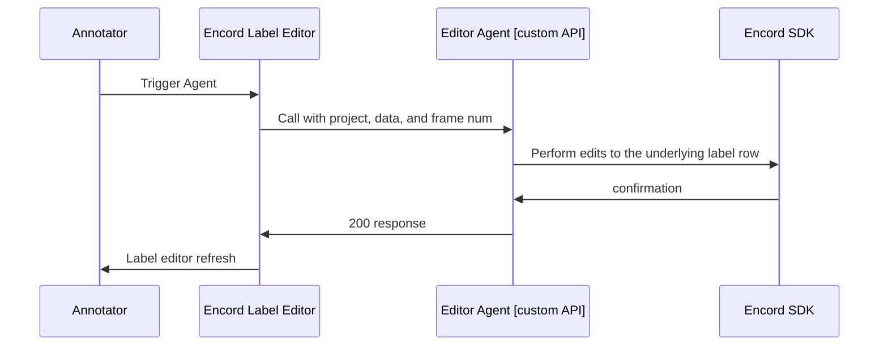

!!! info
Editor Agents are API endpoints triggered on individual tasks within the Label Editor. They differ from [Task Agents][task-agents], which are Workflow components that activate on all tasks passing through the Agent stage.

  

    

      
      
      
      
    

  

  

Editor Agents enable you to integrate your own API endpoint, such as your own model hosted on a server (or in a cloud function), with Encord to enhance your annotation processes.
Agents can be called while annotating in the Label Editor.
Some common use-cases are:

- _Validate the current state of the annotations_ within a frame, video, or image group. You might, for example, want to give the labelers an option to annotate the current state of the labels before submitting.
- Do _custom conversions or modifications_ of labels before they are submitted. For example, you could be simplifying polygons with an RDP algorithm.
- Employ custom prompting models like [DINOv][dinov] or [T-Rex2][trex2] to speed up annotations.
- _Trigger notifications_ internally related to the given task.

Think of these agents as agents that your annotators can trigger at will _while they are labeling_.

## The general concepts

Editor agentes work in the following way:

What you can use `encord-agents` for is filling in the logic that's supposed to happen in the "Editor Agent [custom API]" part of the diagram.
That is, you will be responsible for programatically defining what to do, when your custom api is hit with a `project_hash`, `data_hash`, and potentially a `frame` number.

We help with two different ways of building such Custom APIs:

1. Using [`Google run functions`][gcp-functions] which is Google's way of building cloud functions.
2. Using [FastAPI][fastapi] which is a flexible (self-hosted) python library for building custom APIs.

!!! tip
Actually, the `encord-agents` take a lot of inspiration from [FastAPI][fastapi]. Specifically, we have adopted the idea of [dependency injections][fastapi-dependency-injection] from that library. While our [injection scheme](../dependencies.md) is not as sophisticated, it

Google run functions are good for more light-weight operations like acting as proxies to other model inference APIs or tweaking labels.
FastAPI apps are better suited for actually hosting your own models.

In the next section, you will find a GCP example.
If you need to build a FastAPI application, feel free to [skip it](./fastapi.md).

[task-agents]: ../task_agents/
[dinov]: https://github.com/UX-Decoder/DINOv/tree/main
[trex2]: https://github.com/IDEA-Research/T-Rex/tree/trex2
[gcp-functions]: https://cloud.google.com/functions/docs
[fastapi]: https://fastapi.tiangolo.com/
[fastapi-dependency-injection]: https://fastapi.tiangolo.com/tutorial/dependencies/
