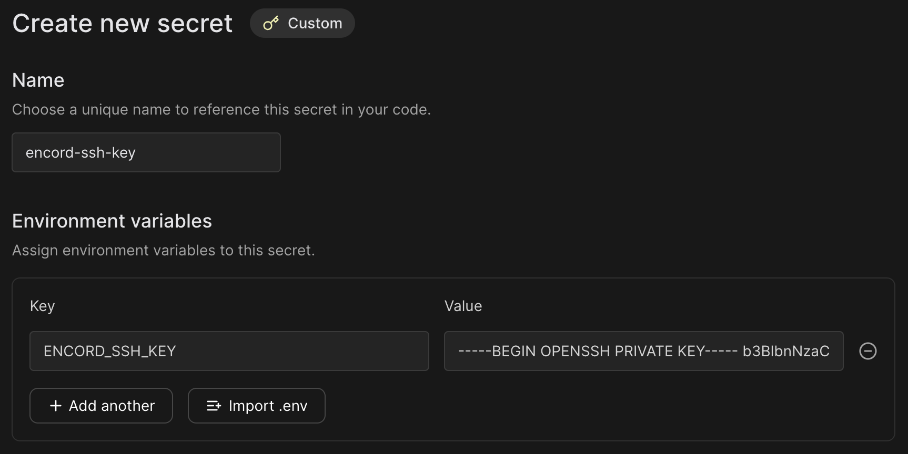

# Hosting Editor Agents with Modal

[Modal][modal-docs] provides a serverless cloud for engineers and researchers who want to build compute-intensive applications without thinking about infrastructure.
The cloud service is well suited for building and hosting editor agents.
On this page, we will show you end-to-end how to set up an editor agent via Modal.

The example, will put a bitmask "ball" in the center of the current image in the label editor.
However, you can look at the [Examples](./examples/index.md) to get more inspiration in terms of what you want your editor agent to do.

!!! info
    Everything within the _FastAPI examples_ will be possible to do with Modal, as Modal is a wrapper around FastAPI.

While this page is not intended to explain everything that [Modal][modal-docs] does -- as it does a lot --, it should be self-contained and enough to get you to a working example.
The page will follow these steps:

1. Setting up authentication
2. Inspect the Modal template
3. Defining the agent logic
4. Testing the agent
5. Deploying the agent

👀 For a complete code example, please see [here]({{ config.repo_url }}/blob/main/docs/code_examples/modal/editor_add_bitmask.py).

## Setting up authentication

You need to [authenticate](../authentication.md) with Encord first.
Once you have a private ssh key (preferably corresponding to a service account), you should also ensure that you have [signed up for Modal](https://modal.com/signup).

Now you can configure the secret:

1. Go to [https://modal.com/secrets][https://modal.com/secrets]
2. Click "Create new secret"
3. Choose the "Custom" option
4. Name it `encord-ssh-key` (you can choose the name but it needs to match the name in the code below)
5. Add an environment variable names `ENCORD_SSH_KEY` with the content of your private ssh key file. Similar to the figure below.



This setup will allow `encord-agents` to authenticate with Encord via the provided key.

## Inspecting the modal template

Next, let's have a look at a template for creating an endpoint that can be used for defining an Editor Agent.

Do make sure that you have installed `encord-agents` and `modal`:

```shell
python -m venv venv
source venv/bin/activate
python -m pip install encord-agents modal
```

Under the hood, Modal uses FastAPI which means that everything that is available in `encord_agents.fastapi` will also be usable within Modal `web_endpoint`s.

Let us have a look:

```python
from typing_extensions import Annotated
from fastapi import Depends
from encord_agents.fastapi.dependencies import LabelRowV2, dep_label_row
from encord_agents import FrameData

import modal

# 1. Define the docker image that will run the code.
image = (
    modal.Image.debian_slim(python_version="3.12")
    .apt_install(
        "libgl1",
        "libglib2.0-0",
    ).pip_install(
        "fastapi[standard]",
        "encord-agents",
    )
)

# 2. Define the app that will hold the endpoint
app = modal.App(name="encord-agents-add-ball", image=image)


# 3. Define the endpoint with access to the secret that we set up.
@app.function(secrets=[modal.Secret.from_name("encord-ssh-key")])
@modal.web_endpoint(method="POST")
def put_ball_on_image(
    frame_data: FrameData,
    label_row: Annotated[LabelRowV2, Depends(dep_label_row)],
):
	# 4. The agent logic goes here
	# This is really a FastAPI endpoint ✨
	...
```

In the template code above, we have

1. Defined a docker image that contain the required dependencies (`encord-agents` and `modal` + `libgl` which is required by `opencv`). Modular automatically sets up a container with these dependencies.
2. Defined an app to contain the endpoints that we define.
3. An actual endpoint definition, which has access to the ssh key. `encord-agents` will know how to access that key (since it's names `ENCORD_SSH_KEY`) and use it for authenticating the `encord` SDK)
4. A place to define our agent logic. There are multiple examples [here](./examples/index.md#fastapi-examples) on what could go in that function.

The magical part is that since this is a FastAPI route, we can, e.g., use all the dependencies defined in [`encord_agents.fastapi.dependencies`](../references/editor_agents.md#encord_agents.fastapi.dependencies) to make our lives easier.

Next, we'll define some concrete logic to go into the agent.

## Defining the agent logic

In this example, we'll add a circular bitmask in the middle of current frame.
However, it could easily be running your own model ([even on the GPU](https://modal.com/docs/guide/gpu)).

In the function definition of our route, we'll add the following code:

```python
@app.function(secrets=[modal.Secret.from_name("encord-ssh-key")])
@modal.web_endpoint(method="POST")
def put_ball_on_image(
    frame_data: FrameData,
    label_row: Annotated[LabelRowV2, Depends(dep_label_row)],
):
    # 1. Find the first bitmask ontology object
	#    Exit if no one is found
    bitmask_object = next(
        (o for o in label_row.ontology_structure.objects if o.shape == Shape.BITMASK),
        None,
    )
    bitmask_object = next((o for o in label_row.ontology_structure.objects if o.shape == Shape.BITMASK), None)
    if not bitmask_object:
        return

    # 2. Ensure we can read image width/height
	#	 Otherwise, it's probably not a vision asset
    w, h = label_row.width, label_row.height
    if w is None or h is None:
        return

    # 3. Construct bitmask with ball in the center
    cw, ch = w//2, h//2
    radius = min(cw, ch) // 2
    mask = np.zeros((h, w), dtype=np.uint8)
    cv2.circle(mask, (cw, ch), radius, 255, -1)  # type: ignore


    # 4. Add it as a label
    ins = bitmask_object.create_instance()
    ins.set_for_frames(
        frames=frame_data.frame,
        confidence=0.8,
        coordinates=BitmaskCoordinates(mask > 0)
    )
    label_row.add_object_instance(ins)

    # 5. Save update
    label_row.save()
```

The code performs the following steps:

1. It ensures that the project ontology has a bitmask object. If it does not, there's nothing to do here
2. It ensures that we're looking at a visual asset (an image, image group, or video)
3. It constructs a bitmask with the appropriate shape and fills in a sphere
4. It adds the bitmask to the label row
5. Saves the labels

Upon completion, the `encord_agents` library will send a 200 response to the label editor, causing the editor to refresh it's state.
The result should be a sphere in the middle of the image.

## Testing the agent

To test the agent, there is a dedicated CLI tool.
You will have to first run the agent locally (with your python environment sourced).
Assuming that the python file you created is named `example.py`, you can run:

```shell
modal serve example.py
```

The command should print a url similar to this

```
└── 🔨 Created web function put_ball_on_image =>
    https://<your_project>-put-ball-on-image-dev.modal.run
```

Let's call it `<agent_url>`.

Now, go to the Encord Label Editor in your browser, viewing an asset for which you would like to test your agent.
Copy the url; let's call it `<editor_url>`.
It should follow this pattern:

```
https://app.encord.com/label_editor/<project_hash>/<data_hash>/<frame>
```

With the endpoint running, you can from another terminal window run:

```
encord_agents test custom '<agent_url>' '<editor_url>'
```

Where you replace the `<agent_url>` and the `<editor_url>` with the relevant urls.
You should see a green box detaining the request and the response.

If the status code is 200, refresh your browser to see the new bitmask in the Label Editor.

## Deploying the agent

Once you're done developing your agent, it's very easy to deploy the agent.
Simply run:

```shell
modal deploy example.py
```

This will deploy the agent more permanently.
Copy the displayed url and configure it in the Encord platform by following [the documentation](https://docs.encord.com/platform-documentation/Annotate/automated-labeling/annotate-editor-agents).

Afterwards, you should be able to right-click the frame in the Label Editor to trigger the agent.

[modal-docs]: https://modal.com/docs
