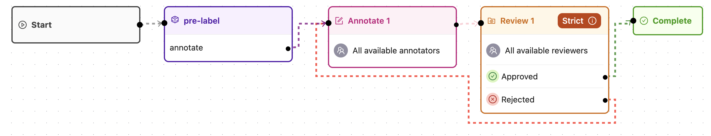

> ℹ️ This example requires `python >= 3.10`. If you do not have python 3.10, we recommend using, e.g., [`pyenv`](https://github.com/pyenv/pyenv){ target="\_blank", rel="noopener noreferrer" } to manage your python versions.

Here's the steps to follow to run your first [task agent](task_agents/index.md).
The example agent will modify the priority of each task before passing it along.
We also provide multiple [task agent examples](task_agents/examples/index.md) and [editor agent examples](editor_agents/examples/index.md).

### 1. Setup

Create a fresh directory and change to that directory.

```shell
mkdir my_project
cd my_project
```

Create a new virtual environment.

```shell
python -m venv venv
source venv/bin/activate
```

Now, install `encord-agents`.

```shell
python -m pip install encord-agents
```

### 2. Encord workflow project

If you don't already have a [workflow project][docs-workflow-project]{ target="\_blank", rel="noopener noreferrer" } which includes an [agent stage][docs-workflow-agent]{ target="\_blank", rel="noopener noreferrer" }, please [create one][docs-create-project]{ target="\_blank", rel="noopener noreferrer" }.

In this example, we use a project workflow that looks like this:



Notice the purple node in the workflow; It's an agent node **with name: `pre-label`**.
Furthermore, it has just one pathway called "annotate."

Copy the `Project ID` in the top left of the project page.

!!! tip
    After [authenticating](./authentication.md), you can check if your existing project has any agent nodes by running this command:
    ```shell
    encord-agents print agent-nodes <your_project_hash>
    ```
    If the project has agent nodes in the workflow, you should see a list similar to this:
    ```shell
    AgentStage(title="pre-label", uuid="b9c1363c-615f-4125-ae1c-a81e19331c96")
    AgentStage(title="evaluate", uuid="28d1bcc9-6a3a-4229-8c06-b498fcaf94a0")
    ```

### 3. Define your agent

In your freshly created directory, create a python file.
In this example, we'll call it `agent.py`.

Copy paste the following template.

```python title="agent.py"
from encord.objects import LabelRowV2
from encord_agents.tasks import Runner

runner = Runner(project_hash="<your_project_hash>")

@runner.stage(stage="pre-label")
def my_agent_logic(lr: LabelRowV2) -> str:
    # ...
    return "annotate"

if __name__ == "__main__":
    runner.run()
```

Notice the `my_agent_logic`, it receives a [`LabelRowV2`][lrv2-class]{ target="\_blank", rel="noopener noreferrer" } instance.
That label row is associated with a task that is currently sitting in the `"pre-label"` agent stage.
Also, the agent is returning the name of the pathway that the task is supposed to follow upon agent completion.

Now, it's our job to define what's supposed to happen with this piece of data.
In this example, we'll keep it simple and assign a priority based on the file name.
If the file name contains `"london"` we'll give it high priority otherwise a low priority.

Update the `my_agent_logic` to look like this:

```python
@runner.stage(stage="pre-label")
def my_agent_logic(lr: LabelRowV2) -> str:
    lr.set_priority(priority=float("london" in lr.data_title))
    return "annotate"
```

> **Too simple?**  
> If the example is too simple, please see the [task examples](task_agents/index.md)
> to find something more useful to your use-case.

### 4. Running the agent

From `agent.py` above, notice the last part.

```python
if __name__ == "__main__":
    runner.run()
```

Run the agent by executing the following command:

```shell
python agent.py
```

[docs-workflow-project]: https://docs.encord.com/sdk-documentation/projects-sdk/sdk-workflow-projects#workflow-projects
[docs-workflow-agent]: https://docs.encord.com/platform-documentation/Annotate/annotate-projects/annotate-workflows-and-templates#agent
[docs-create-project]: https://docs.encord.com/platform-documentation/Annotate/annotate-projects/annotate-create-projects
[lrv2-class]: https://docs.encord.com/sdk-documentation/sdk-references/LabelRowV2
