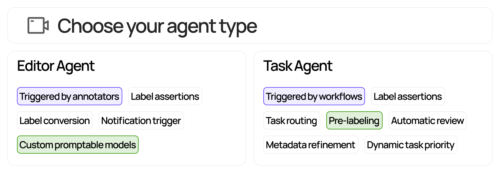

<h1 align="center">
  <a href="https://encord.com"></a>
</h1>

<p align="center">
<a href="https://github.com/encord-team/encord-notebooks" target="_blank">Try it Now</a> |
<a href="https://encord.com/blog/" target="_blank">Blog</a> |
<a href="https://join.slack.com/t/encordactive/shared_invite/zt-1hc2vqur9-Fzj1EEAHoqu91sZ0CX0A7Q" target="_blank">Join our Community</a>
</p>

<div style="display: flex; justify-content: space-between;">
  <div style="flex: 1; padding: 10px; text-align: center">
    <a href="https://agents-docs.encord.com/" target="_blank" style="text-decoration:none">
      
    </a>
    <a href="https://github.com/encord-team/encord-notebooks" target="_blank" style="text-decoration:none">
      
    </a>
    <a href="https://colab.research.google.com/drive/1wvKAQ61JPebGnAT4nLXsfJRbx7dvtFdX?usp=sharing" target="_blank" style="text-decoration:none">
      
    </a>
    <a href="https://join.slack.com/t/encordactive/shared_invite/zt-1hc2vqur9-Fzj1EEAHoqu91sZ0CX0A7Q" target="_blank" style="text-decoration:none">
      
    </a>
    <a href="https://twitter.com/encord_team" target="_blank" style="text-decoration:none">
      
    </a>
  </div>
</div>

Easily build agents for the Encord echo system.
With just few lines of code, you can take automation to the next level.

Here's how to build a [Task Agent](task_agents/index.md) that prioritizes annotation tasks based on data titles.

```python title="example_task_agent.py"
from typing import Any

from encord.objects import LabelRowV2
from encord_agents.tasks import Runner

runner = Runner(project_hash="<your_project_hash>")

@runner.stage(name="Agent 1")
def by_city(lr: LabelRowV2) -> str:
    location = "New York" if "NY" in lr.data_title else "San Francisco"

    priority = 0.
    if location == "New York":
        priority = 1.
    else if location == "San Francisco":
        priority = 0.5

    label_row.set_priority(priority=priority)

if __name__ == "__main__":
    runner.run()
```

> 💡 For the full end-to-end example, please see [here](TODO).

This repository provides utility functions and examples for building both [editor agents][editor_agents] and [task agents][task_agents].

**Key features:**

1. ⚡**Easy**: Multiple template agents to be adapted and hosted via GCP, own infra, or cloud.
2. ⏩ **Convenient**: The library conveniently loads data via the [Encord SDK][encord_sdk] upon request.
3. 👨‍💻 **Focus**: With essential resources readily available, you can focus on what matters. Create agents with pre-existing (or custom) dependencies for loading labels and data.
4. 🤏 **Slim**: the library is slim at it's `core` and should not conflict with the dependencies of most projects.

**Choose what type of agent to use:**



If you plan to build an editor agent, please go to the [Editor agents section](#editor-agents).

If you plan to build a label agent, please go to the [Task agents section](#task-agents).

[editor_agents]: https://docs.encord.com/platform-documentation/Annotate/automated-labeling/annotate-editor-agents
[task_agents]: https://docs.encord.com/platform-documentation/Annotate/automated-labeling/annotate-task-agents
[encord_sdk]: https://pypi.org/project/encord/
[fastapi]: https://fastapi.tiangolo.com/
[poetry]: https://python-poetry.org/
[label_row_v2]: https://docs.encord.com/sdk-documentation/sdk-references/LabelRowV2
[pipx]: https://github.com/pypa/pipx
[frame-data-code]: https://github.com/encord-team/encord-agents/blob/main/encord_agents/core/data_model.py#L6
[editor-agent]: https://github.com/encord-team/encord-agents/blob/main/encord_agents/gcp/wrappers.py#L65
[docs-ssh-key-access]: https://docs.encord.com/sdk-documentation/sdk-references/EncordUserClient#create-with-ssh-private-key
[docs-sdk-label]: https://docs.encord.com/sdk-documentation/sdk-labels/sdk-working-with-labels
[google-gcp-functions-docs]: https://cloud.google.com/functions/docs/create-deploy-gcloud
[google-gcp-secrets-docs]: https://cloud.google.com/functions/docs/configuring/secrets
[fastapi-deploy-docs]: https://fastapi.tiangolo.com/deployment/
