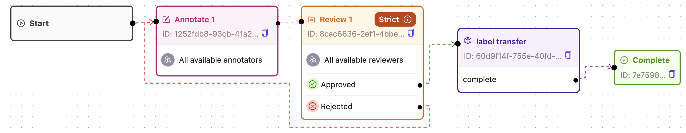
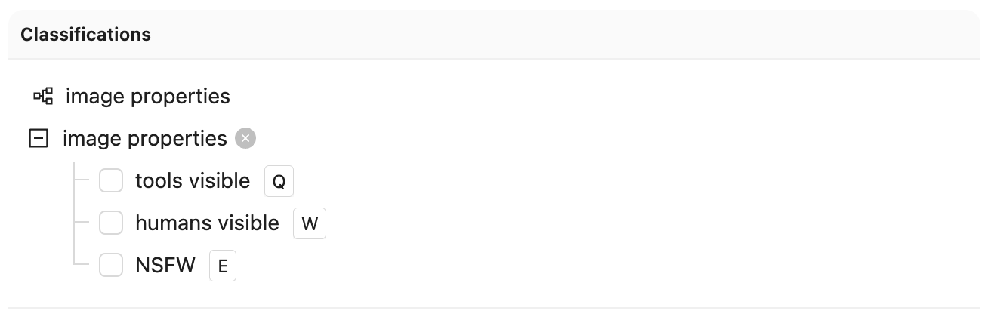
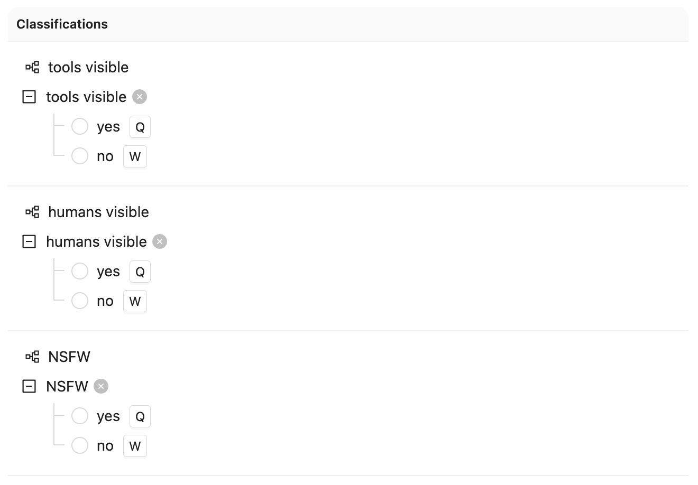
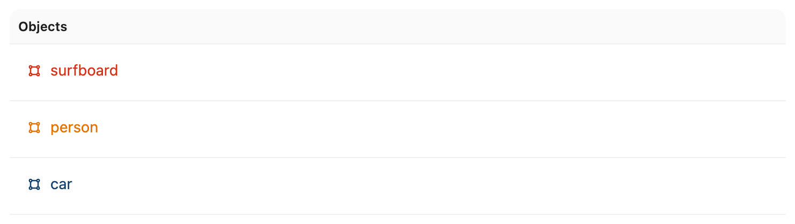
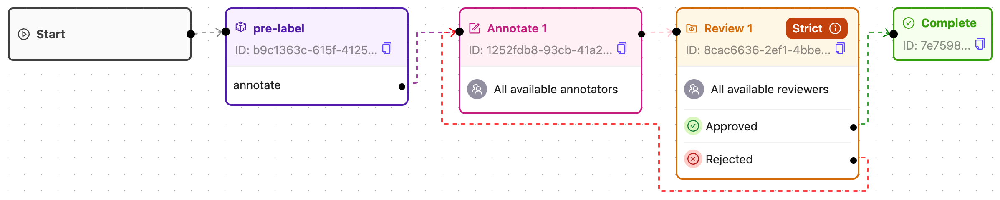

## Prioritizing tasks based on file names

This example shows how to have an agent node early in the workflow which gives every task a priority before sending it on to the annotation stage.

For a project with a workflow similar to this:

<figure style="text-align: center">
  
  Project workflow
</figure>

Create a new file called `agent.py` with the following content:

<!--codeinclude-->

[agent.py](../../code_examples/tasks/prioritize_by_data_title.py)

<!--/codeinclude-->

The code will

- Instantiate a runner.
- Define a stage implementation that looks for the data title of a given task and parses the stem of the data title as an int.
- Set the priority as a number between zero and one.
- Pass the task to the annotation stage by returning the appropriate pathway uuid.

**To run the agent, follow these steps:**
To make this example run in practice, you need to

1. Ensure that you've exported your private key, as described in the [authentication section](../../authentication.md){target=\_blank}, and that you've [installed](../../installation.md){target=\_blank} the `encord_agents` package.
1. Create a workflow similar to the above
1. Copy the code to an `agent.py` file
1. Adjust these ids `<your_project_hash>`, `<your_agent_stage_uuid>`, and `<your_pathway_uuid>` to correspond to those ids of your workflow.
1. Execute the file `python agent.py`

## Transferring labels to a twin project

This example shows how to take checklist labels annotated in "Project A" and translate them into yes/no radio labels in "Project B".

Assume you have an ontology like this one in Project A:

{width=600}

and you want to ensure that everytime a task in Project A is compelte, it gets translated to a "model friendly version" with radio classifications in Project B.
A good way to do it is make an agent do the translation to the ontology of Project B:

{width=600}

> Notice how there are now three classifications (with the exact same names!) with two options each.

To build an agent that automatically translates between the two, the [`dep_twin_label_row` dependency](../../reference/task_agents.md#encord_agents.tasks.dependencies.dep_twin_label_row) is a good place to start.
For every label row from Project A that the agent is called with, it will automatically get the corresponding label row (and potentially workflow task) from project B.

> **Disclaimer:** Project A and Project B must be attached to the same datasets.

The code that defines such an agent might look similar to this:

<!--codeinclude-->

[twin_project.py](../../code_examples/tasks/twin_project.py)

<!--/codeinclude-->

For this code to work, the project workflows could look like this:

<figure style="text-align: center">
  
  The workflow of Project A.
</figure>

<figure style="text-align: center">
  
  The workflow of Project B.
</figure>

With this setup, all the manual work happens in Project A and Project B just becomes a mirror
with transformed labels.

Which would mean that the agents would be defined with the following decorator to
make the workflow stage association explicit.

```python
@runner.stage(stage="60d9f14f-755e-40fd-...")  # <- last bit omitted
```

> Notice the match between the uuid in the "label transfer" agent stage of the workflow in Project A and the uuid in the decorator.

**To prepare your projects:**

Create two projects, one with each of the (classification) ontologies and workflows displayed above.
For this particular example, it is not important which checklists the ontologies have as long as their names match between the two ontologies.
Make sure that both projects are pointing to the same dataset(s).

**To run the agent, follow these steps:**

1. Ensure that you've exported your private key, as described in the [authentication section](../../authentication.md){target=\_blank}, and that you've [installed](../../installation.md){target=\_blank} the `encord_agents` package.
2. Update the code to capture your own project hashes. (replace `<project_hash_a>` and `<project_hash_b>`.
3. Update the `stage` argument to the decorator to reflect the uuid of your actual agent stage.
4. Update the completion pathway uuids
5. Run the file: `python twin_project.py`

Now you should see tasks that have been approved by review starting to move to the Complete state and labels starting to show up

## Pre-label video with _fake_ predictions

Suppose yuou have a _fake_ model like this one, which predicts labels, bounding boxes and, confidenceds.

<!--codeinclude-->

[Fake model predictions](../../code_examples/tasks/prelabel_videos.py) lines:28-51

<!--/codeinclude-->

And you have an ontology looking like this:

<figure style="text-align: center">
  
  Project ontology.
</figure>

If you then set up a workflow like this one with a pre-labeling agent node before the annotation stage,
you will be able to pre-label the tasks with the model predictions.

<figure style="text-align: center">
  
  Project workflow.
</figure>

Then you can make a pre-labeling agent that looks like this:

<!--codeinclude-->

[prelabel_video.py](../../code_examples/tasks/prelabel_videos.py) lines:10-78

<!--/codeinclude-->

Notice how we use the [`dep_video_iterator` dependency](../../reference/task_agents.md#encord_agents.tasks.dependencies.dep_video_iterator) to automatically load in an iterator of frames in the form or RGB np arrays from the video.

**To run the agent, follow these steps:**

1. Ensure that you've exported your private key, as described in the [authentication section](../../authentication.md){target=\_blank}, and that you've [installed](../../installation.md){target=\_blank} the `encord_agents` package.
1. Ensure that your project has a stage names "pre-label" with a pathway names "annotate" and an ontology similar to the above.
1. Replace `<project_hash>` with your own project hash.
1. Run the file: `python prelabel_video.py`

Once you start annotating upon agent completion, you should see frames pre-populated with bounding boxes.

## Examples that we're working on

- Pre-labeling with YoloWorld
- Transcribing with Whisper
- Routing with Gemini
- Prioritizing with GPT-4o mini
- Evaluating Training projects
- HF Image segmentation API
- HF LLM API to classify frames
